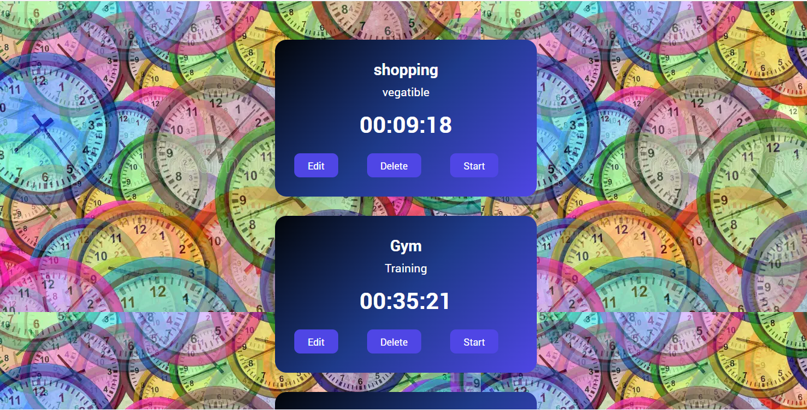
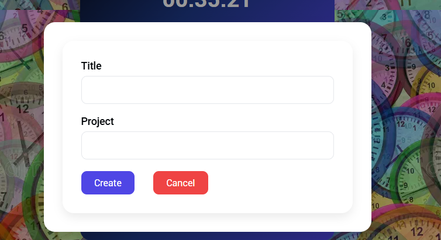

#  INTRODUCTION
The project is a frontend and backend timer application using React, Vite, Node.js, and Express, featuring CRUD timers, start/stop functionality, and live elapsed time tracking. Integrated frontend with a backend API and implemented persistent data storage using JSON files.
#TOOLS USED
- Frontend: React, Vite, responsive design, state management with hooks, dynamic forms
- Backend: Node.js, Express, RESTful API, CRUD operations, file-based storage
- Deployment: Deployment on Render 
- UI/UX: Interactive timer cards, gradient styling, responsive design
#Output

